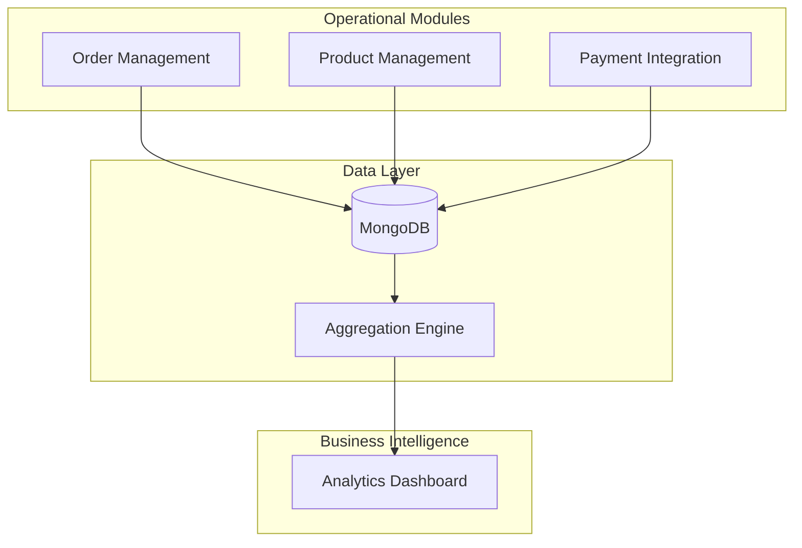
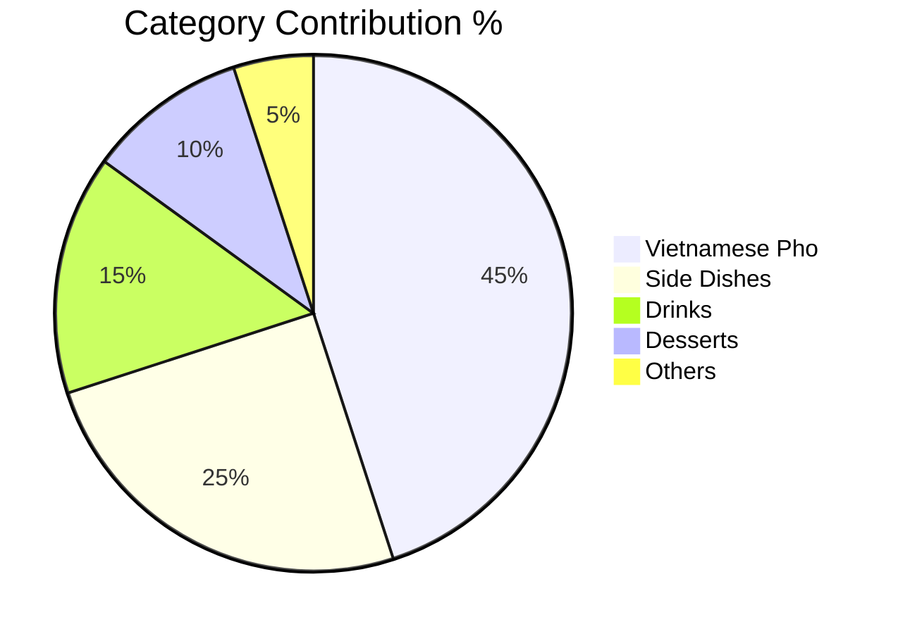
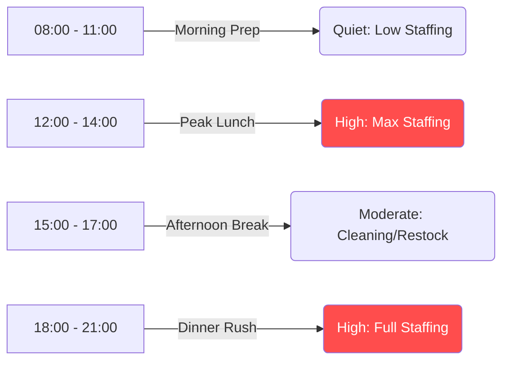

# From QR Ordering to Data-Driven Decisions: Optimizing F&B Operations with a Luxury POS System

## 🎯 Project Overview

This project is a sophisticated **Point of Sale (POS) System** designed for modern F&B businesses (Cafes and Restaurants). It moves beyond traditional order-taking by implementing a seamless **QR-based Ordering system** integrated with a **Data Analytics Dashboard**.

The core philosophy of this system is: **"Optimize operations to capture high-quality data, then use that data to drive business growth."**

*   **Operational Role (BA):** Automating the Order-to-Cash (O2C) flow to reduce human error and manual labor.
*   **Analytical Role (DA):** Transforming every transaction into a structured data point for strategic decision-making.

### 🛠 Tech Stack
*   **Frontend:** React.js, Vite, Sass (Luxury Dark Theme), React-Bootstrap, Recharts.
*   **Backend:** Node.js, Express.js.
*   **Database:** MongoDB (Mongoose) for flexible, document-based transaction storage.
*   **Payment Integration:** PayOS (Integrated QR Payment Flow).
*   **Communication:** Socket.io for real-time order updates.

---

## 🧩 Business Case Study

### 1. The Business Problem

Before implementing this system, typical F&B operations faced two major bottlenecks:

#### **A. Operational Inefficiency**
*   **Manual Order Entry:** Waitstaff spending 30% of their time just taking orders and relaying them to the kitchen.
*   **Payment Friction:** Manual cash handling and separate POS/Payment devices leading to reconciliation errors.
*   **Information Silos:** Communication between the front-of-house and kitchen was prone to "lost orders" during peak hours.

#### **B. The "Data Blindness" Problem**
*   **Intuition-Based Decisions:** Owners often decided on menu changes or staffing based on "feeling" rather than actual performance metrics.
*   **Wasted Customer Data:** Transactions happened, but no profile or behavior data was captured for future marketing.
*   **Unclear Peak Performance:** Difficulty identifying exact bottleneck hours versus "busy-looking" hours.

---

### 2. Solution Overview

The system was designed as a dual-layer solution:

*   **Operational Layer (The POS):** A high-contrast, luxury dark-themed interface for staff and a mobile-friendly QR menu for customers. It handles the entire lifecycle of an order from scan to payment.
*   **Data Layer (The Dashboard):** A centralized intelligence hub that aggregates real-time data to provide actionable insights into revenue, time-based performance, and customer retention.

---

### 3. The Business Flow (Order-to-Cash)

Every interaction in the system is designed to generate a usable data trace:

```mermaid
graph LR
    A[Customer Scans QR] -->|Capture Entry Time| B[Digital Menu Selection]
    B -->|Capture Basket Intent| C[Real-time Order Submission]
    C -->|Kitchen Sync| D[Integrated Payment]
    D -->|Capture Transaction Log| E[Data Aggregation]
    E -->|Real-time Visualization| F[Dashboard]
    F -->|Business Insight| G[Strategic Decision]
    
    style A fill:#f9f,stroke:#333,stroke-width:2px
    style D fill:#c5a059,stroke:#333,stroke-width:2px
    style G fill:#00d2ff,stroke:#333,stroke-width:2px
```

1.  **Customer Scans QR:** Capture entry time and table location.
2.  **Digital Menu Selection:** Capture interest/browsing data (even if items aren't ordered yet).
3.  **Real-time Order (O2C Start):** Capture basket composition and modification preferences.
4.  **Integrated Payment:** Capture payment method preference and exact transaction timestamp.
5.  **Data Capture:** Structured JSON logs are stored in MongoDB, ready for the aggregation engine.
6.  **Dashboard Visualization:** Real-time transformation of raw logs into KPI cards and trends.
7.  **Strategic Decision:** Owner uses insights to adjust pricing, staffing, or inventory.

---

### 4. System Design (BA Mindset)

Focusing on process optimization and reliability:

*   **Order Management:** Real-time synchronization between Customer, Waiter, and Kitchen via Socket.io.
*   **Dynamic Product Management:** Modular inventory control allowing for instant menu updates and price adjustments.
*   **Integrated Payment Module:** Built-in QR payment generation (PayOS) to ensure the payment status is automatically tied to the order, eliminating manual verification.
*   **Multi-Role Access:** Granular permissions for Admin (Full Analytics) and Staff (Order Fulfillment).

---

### 5. Data Design (DA Mindset)

The schema was designed for **Analytics-First** storage:

*   **Granular Timestamps:** Tracking `created_at`, `served_at`, and `paid_at` to calculate preparation times and turnover rates.
*   **Categorization:** Every product belongs to a category and sub-category, enabling "Contribution %" analysis.
*   **Customer ID Tracking:** Identifying returning customers vs. new customers to calculate Retention Rate (CRR).
*   **State History:** Storing the "Life of an Order" to identify where cancellations or bottlenecks occur in the kitchen.

---

### 6. Key Data Insights (Simulated Results)

Based on the implemented aggregation logic, the system surfaced the following high-value insights:

*   **Peak Time Heatmap:** 42% of total daily revenue occurs between **12:00 PM - 1:30 PM**, yet prep times increase by **15%** during this window, indicating a need for better kitchen prep-staging.
*   **Customer Retention:** **28%** of customers are "Returning," and their **Average Order Value (AOV)** is **35% higher** than new customers.
*   **Product Performance:** The "Vietnamese Pho" category accounts for only **20%** of order volume but contributes **45%** of the net margin.
*   **Cross-sell Opportunity:** **65%** of diners order a main dish but no beverage, identifying a massive revenue gap for drinks/desserts.
*   **Payment Preference:** **85%** of customers prefer QR Transfer over cash when offered a digital menu, reducing cash handling overhead by **2 hours/day**.

---

### 7. Business Recommendations

#### **A. Operational Optimization (BA-Driven)**
*   **Peak-Staging:** Implement "Batch Prep" for top-selling items 15 minutes before the identified 12:00 PM peak.
*   **Role Refinement:** Move one waiter from order-taking to "Order Runner" during peak hours, as the QR system handles 90% of order entry.

#### **B. Revenue Optimization (DA-Driven)**
*   **Strategic Bundling:** Create a "Main + Signature Drink" bundle priced at 115% of the main dish to capture the identified 65% beverage gap.
*   **Loyalty Push:** Launch a "Returning Customer" discount for the 3rd visit to push the 28% retention rate toward 35%.

---

### 8. Dashboard Structure

The Admin Dashboard is divided into 4 specialized views to support specific decision-making:

#### **A. Sales Analysis (Product Performance)**

*   **Overview Tab:** High-level KPIs (Total Rev, AOV, Growth Trends) for a quick "Business Health" check.
*   **Sales Tab:** Product and Category performance metrics to decide which menu items to keep or cut.

#### **B. Time-Based Insights (Operations)**

*   **Time Tab:** Hourly Heatmaps and Daily Trends to optimize staffing schedules.
*   **Customer Tab:** Retention and Behavior analytics to drive marketing and loyalty strategies.

---

### 9. Business Impact (Simulation)

*   **+20% Revenue:** Driven by digital upselling and higher table turnover rates.
*   **-30% Staff Cost:** Efficiency gains from QR ordering reduce the need for manual order takers.
*   **100% Data Accuracy:** Elimination of manual entry errors and payment reconciliation issues.

---

### 10. Future Roadmap

1.  **Demand Forecasting:** Using historical time-data to predict stock needs for the following week.
2.  **Customer Segmentation:** Automatically tagging customers as "High Spenders" or "Occasional Diners" for targeted promos.
3.  **AI Recommendations:** Integrating an AI engine to suggest pairings to customers at the moment of QR checkout.

---

**Developed with a focus on transforming F&B operations from a manual struggle into a data-driven competitive advantage.**
