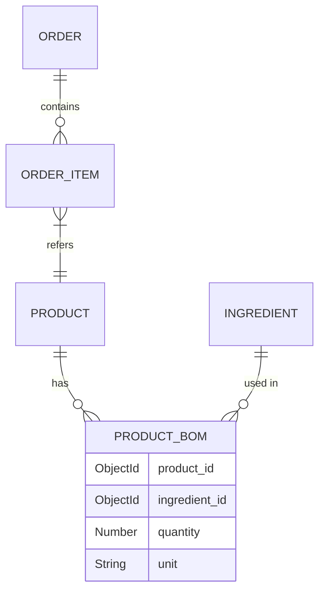

# SmartOrder POS: Enterprise-Grade F&B Ecosystem 🍽️


[](https://opensource.org/licenses/MIT)
[](https://nodejs.org/)
[](https://reactjs.org/)
[](https://www.mongodb.com/)
[](https://socket.io/)
[](https://deepmind.google/technologies/gemini/)

**SmartOrder POS** is a sophisticated, full-stack restaurant management ecosystem designed to eliminate operational friction and transform raw transactions into actionable business intelligence. It features a hybrid ordering model (QR + Staff POS), an AI-driven customer assistant, and a real-time data aggregation engine.

---

## 📖 Table of Contents
- [✨ Core Capabilities](#-core-capabilities)
- [🛠 Technical Architecture](#-technical-architecture)
- [📂 Directory Structure](#-directory-structure)
- [🗄️ Data Modeling (BOM Focus)](#️-data-modeling-bom-focus)
- [📡 API & Real-time Integration](#-api--real-time-integration)
- [🤖 AI Chatbot Engine](#-ai-chatbot-engine)
- [💳 Payment & Billing Logic](#-payment--billing-logic)
- [🚀 Deployment & Setup](#-deployment--setup)

---

## ✨ Core Capabilities

### 📱 Guest Experience
- **Autonomous QR Ordering:** Zero-app required. Customers scan a table-specific QR to access a dynamic, real-time menu.
- **AI Concierge:** A Google Gemini-powered chatbot that analyzes menu context and nutritional data to provide personalized dish recommendations and direct "Add to Cart" functionality.
- **Real-time Status Tracking:** Monitor order progress from "Pending" to "Preparing" and "Served".

### 🧑‍🍳 Staff & Kitchen Operations
- **Kitchen Display System (KDS):** A live, low-latency queue using Socket.io for instant order synchronization.
- **Inventory & BOM Management:** Automatic ingredient deduction upon order confirmation. Real-time low-stock alerts based on Bill of Materials (BOM) logic.
- **Table Orchestration:** Intuitive interface for merging tables, transferring sessions, and managing occupancy states.

### 📊 Business Intelligence (Admin)
- **Revenue Analytics:** Deep-dive into AOV (Average Order Value), peak-hour heatmaps, and category-wise margin analysis.
- **Staff Performance:** Tracking serving latency and order accuracy metrics.
- **CRM Lite:** Identifying returning customers and their consumption patterns.

---

## 🛠 Technical Architecture

The system follows a **Modular Monolith** architecture with a clear separation of concerns, optimized for real-time responsiveness.

- **Frontend:** React 18 with Vite. State management via Redux Toolkit. UI components leverage Ant Design for the Admin/Staff portal and a custom mobile-first SCSS framework for the Guest Menu.
- **Backend:** Node.js & Express.js. Implements a Service-Controller-Model pattern.
- **Real-time:** Socket.io handles bi-directional events for order status, kitchen alerts, and payment confirmations.
- **Database:** MongoDB Atlas. Utilizes Mongoose for schema validation and complex aggregations.

---

## 📂 Directory Structure

```text
SmartOrder_POS/
├── backend/
│   ├── app/
│   │   ├── controllers/    # Business logic (Order, Payment, Chatbot, etc.)
│   │   ├── models/         # Mongoose schemas (BOM, Ingredient, Order, etc.)
│   │   ├── routes/         # RESTful API endpoints
│   │   ├── services/       # Third-party integrations (PayOS, Gemini)
│   │   └── socket/         # Socket.io event handlers
│   ├── static/             # Public assets (avatars, product images)
│   └── server.js           # Entry point & Middleware config
├── frontend/
│   ├── src/
│   │   ├── components/     # Reusable UI units
│   │   ├── pages/          # View components (Admin, Staff, Guest)
│   │   ├── redux/          # State management logic
│   │   ├── services/       # API calling modules
│   │   └── styles/         # Global SCSS & Theme tokens
│   └── vite.config.js
└── assets/                 # Documentation assets
```

---

## 🗄️ Data Modeling (BOM Focus)

A critical feature of the system is the **Bill of Materials (BOM)** logic, which ensures inventory integrity.



- **Ingredient Deduction:** When an order status moves to `SERVED`, the system iterates through the `ProductBOM` for each item and decrements the `Ingredient.stock_quantity`.
- **Validation:** Orders are blocked if any ingredient required for the requested items is below the safety threshold.

---

## 🤖 AI Chatbot Engine

The "Smart" in SmartOrder comes from a hybrid AI implementation:

1.  **Rule-based Interceptor:** Quickly handles common intents (Greetings, "Show Menu") with 0ms latency.
2.  **Gemini AI Layer:** Uses `gemini-1.5-flash` for complex nutritional queries. 
3.  **Function Calling:** The AI can directly execute `add_to_cart_ui` commands, allowing customers to add recommended items to their cart through natural conversation.
4.  **Context Injection:** Every AI prompt is injected with a real-time, cached snapshot of the current menu and ingredient data.

---

## 💳 Payment & Billing Logic

The system implements a flexible billing engine integrated with **PayOS**:

- **Split-Bill Patterns:**
    - **By Item:** Specific guests pay for specific items.
    - **By Percentage:** Equal or custom percentage split.
    - **By Amount:** Fixed amount contribution.
- **Table Merging:** Supports the "Master/Slave" table logic, allowing multiple physical tables to be unified into a single financial session.
- **PayOS Webhooks:** Secure, signature-verified webhooks ensure that order statuses are updated instantly upon successful bank transfer.

---

## 🚀 Deployment & Setup

### **Environment Configuration (.env)**
```env
MONGODB_URI=your_mongodb_connection_string
PAYOS_CLIENT_ID=your_client_id
PAYOS_API_KEY=your_api_key
PAYOS_CHECKSUM_KEY=your_checksum_key
GEMINI_API_KEY=your_google_ai_key
JWT_SECRET=your_secure_secret
```

### **Installation**
1. **Repository Setup**
   ```bash
   git clone https://github.com/your-username/SmartOrder_POS.git
   cd SmartOrder_POS
   ```
2. **Backend Services**
   ```bash
   cd backend && npm install
   npm start # Starts server on port 8080
   ```
3. **Frontend Application**
   ```bash
   cd ../frontend && npm install
   npm run dev # Starts Vite dev server
   ```

---

**Built with precision to transform the F&B industry through technology.**
